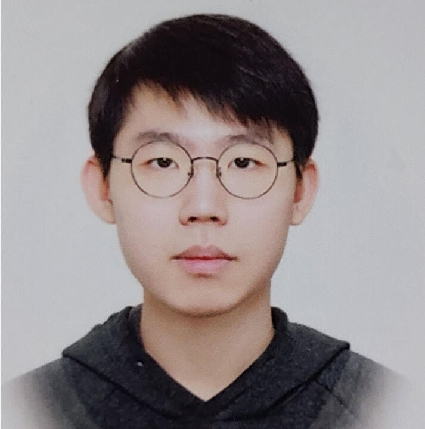

<table>
  <tbody>
    <tr>
      <td align="middle">
         
        
      </td>
      <td valign="top" style="padding-left: 1em;">
        <h1>Sanghoon Park</h1>
        Graduate student (Advisor: <a href="https://joonsung-kim.github.io/">Prof. Joonsung Kim</a>) 
        <a href="https://cse.skku.edu/eng_cse/index.do">Department of Computer Science and Engineering</a> 
        <a href="https://sw.skku.edu/eng_sw/index.do">College of Computing and Informatics</a> 
        <a href="https://skku.edu/">Sungkyunkwan University</a>
         
        Lab: <a href="https://cisa.skku.edu/">Computer Infrastructure System Architecture (CISA) Lab</a> 
        Email: <a href="mailto:sanghoonpark@skku.edu">sanghoonpark@skku.edu</a> 
         
        </td>
    </tr>
  </tbody>
</table>

## Research Interests
* Computer Architecture
* Datacenter Architecture
* AI Infrastructure

## Education
<ul>
    <li>
    <b>Sungkyunkwan University</b>, Suwon, Republic of Korea
    <ul>
        <li>M.S. Student in Computer Science and Engineering (Advisor: <a href="https://joonsung-kim.github.io/">Prof. Joonsung Kim</a>)</li>
        <li>Mar. 2026 ~ Current</li>
    </ul>
    </li>
     
    <li>
    <b>Sungkyunkwan University</b>, Suwon, Republic of Korea
    <ul>
        <li>B.S. in Computer Science and Engineering</li>
        <li>B.S. in Mathematics</li>
        <li>Mar. 2020 ~ Dec. 2024</li>
    </ul>
    </li>
</ul>

## Publications
To be updated

## Honors and Awards
To be updated